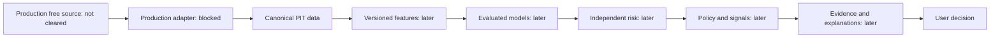

# System boundaries

P3 under D43-D44 adds `alphalens_data.quality`, operating on P2 canonical inputs.
Acquisition/parsing remains P2; the file loader invokes P2 replay. Quality reports
are deterministic files, without new migrations. P4 starts after P3 gate/commit;
P5 is subsequently authorized under D46-D48. `alphalens_data.universe` resolves separately versioned
identity/membership facts with available_at gating and consumes one-session P3
quality without deleting historical existence. Snapshot/audit files remain separate
from P2 raw metadata; no P4 migration.

Modular monolith plus separately deployed background workers later. No execution
subsystem. Source: §§6, 8–19; approved decisions govern conflicts.

No path from any component to a real broker/order service. Future manual transaction
recording is user-reported history, not order execution.

Current code: health-only local FastAPI and provider-neutral P1 contracts/eligibility/
canonical serialization/in-memory sample check, plus a bounded offline Mendeley
research-file adapter and reproducible replay. The diagram describes the future
production path, which remains blocked. Local research artifacts have a separate
RESEARCH_FIXTURE_DATASET scope and do not enter the canonical PIT path above.
P1_PRODUCTION_DATA_CLEARANCE = OPEN. D40-D42 separately authorize P2 infrastructure
development using fixtures. The source-neutral `alphalens_data.ingestion` package
adds immutable raw landing, parser/normalizer contracts, row validation/quarantine,
canonical Parquet/JSON, replay and metadata repositories without importing FastAPI.
Acquisition is a separate byte-source protocol alongside the existing provider.py
boundary; no provider capabilities or production adapter are implied.

API owns validation/application/domain orchestration, permissions and authoritative
calculations later. Data package cannot import API/FastAPI. Workers will orchestrate
shared services; backtest and paper trading will share decision policy. Frontend
is presentation only and deferred.

PostgreSQL: canonical structured records and ledger/application history; object
storage/Parquet: raw and dataset/artifact snapshots; Redis: disposable coordination
and cache when justified. P2 technical metadata tables are owned by db/migrations;
the P5 canonical financial/entity schema is now owned by migration 002. The event
broker remains deferred. `alphalens_data.canonical` reads pinned versioned inputs,
preserves raw/quarantine evidence, delegates identity/membership to P4 and exposes
P3 quality separately from availability. PostgreSQL repositories own atomic immutable
writes; analytical Parquet is derived from immutable snapshots, not separately edited.
Fundamental contracts exist with writes disabled and reads UNAVAILABLE.
`alphalens_features` consumes only P5 cutoff snapshots and delegates quality and
universe eligibility to P3/P4 through P5. Raw-file verification belongs to the P5
loader, never feature mathematics. Feature JSON/Parquet and manifests remain local
analytical files; no online feature store or migration. No API/vendor dependency,
target input, fitted scaler or model. P7 follows only after P6 gate/commit; stop
before P8. See [canonical boundary](../data/p5-canonical-data-model.md).

Revised filings, identifier history, universe membership and adjustments must
remain reconstructible. Required future linkage: data_snapshot_id, feature version,
model/target version, risk/policy version, prediction timestamp and explanation ID.

Under D26–D35, local free PostgreSQL/container deployment is sufficient in principle;
cloud deployment is optional and cannot introduce a required paid dependency.
Future deployment still requires least privilege, private services, appropriate
transport/secret protection, reproducible setup and tested recovery. Authentication
and monitoring must have free self-hostable paths. No cloud resources are provisioned.
