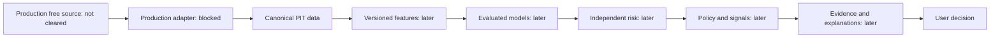

# System boundaries

Modular monolith plus separately deployed background workers later. No execution
subsystem. Source: §§6, 8–19; approved decisions govern conflicts.

No path from any component to a real broker/order service. Future manual transaction
recording is user-reported history, not order execution.

Current code: health-only local FastAPI and provider-neutral P1 contracts/eligibility/
canonical serialization/in-memory sample check, plus a bounded offline Mendeley
research-file adapter and reproducible replay. The diagram describes the future
production path, which remains blocked. Local research artifacts have a separate
RESEARCH_FIXTURE_DATASET scope and do not enter the canonical PIT path above.
PRODUCTION_DATA_CLEARANCE = OPEN. P2 has not started.

API owns validation/application/domain orchestration, permissions and authoritative
calculations later. Data package cannot import API/FastAPI. Workers will orchestrate
shared services; backtest and paper trading will share decision policy. Frontend
is presentation only and deferred.

PostgreSQL: canonical structured records and ledger/application history; object
storage/Parquet: raw and dataset/artifact snapshots; Redis: disposable coordination
and cache when justified. No production schema or event broker is implemented.

Revised filings, identifier history, universe membership and adjustments must
remain reconstructible. Required future linkage: data_snapshot_id, feature version,
model/target version, risk/policy version, prediction timestamp and explanation ID.

Under D26–D35, local free PostgreSQL/container deployment is sufficient in principle;
cloud deployment is optional and cannot introduce a required paid dependency.
Future deployment still requires least privilege, private services, appropriate
transport/secret protection, reproducible setup and tested recovery. Authentication
and monitoring must have free self-hostable paths. No cloud resources are provisioned.
