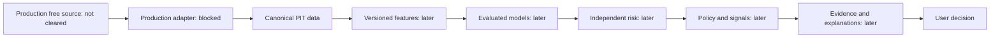

Current scope amendment D65-D67 authorizes P15 then P16 only, with separate
verification/commits from P14 5eaeb01. P15 owns portfolio ledger/accounting/valuation;
P16 owns forward simulated intents/fills and reuses P15. P17/API, frontend and live
pipeline remain deferred. No real execution or broker credential path. Production
clearance OPEN/use NOT_CLEARED, fundamentals UNAVAILABLE. Historical statuses below
are preserved as historical records, not restrictions on this newly approved scope.

# System boundaries

Current D62-D64 authorize P13 decision states followed by P14 offline explanations,
with separate verification/commits. The decision workspace owns policy and state;
it consumes immutable PIT P12/P11 evidence, never P7 targets or future reports.
P13 synthetic position evidence is TEST_ONLY lifecycle context, not user holdings,
cash accounting or P15 management. No API/frontend/live-data work is authorized.
Normal insufficient model-selection evidence cannot produce validated entries.

P13 passed/committed as 490de2e before P14 implementation. P14 explains only
reproduced P13 decisions with exact P12/P11/P6 evidence, complete risk/ranking
decomposition and checked local prediction attribution. Template text has evidence
references; missing inputs remain explicit. Attribution owns no model fitting or
label join. A bounded trusted-local P9 helper uses the existing reviewed skops
allowlist and requires model checksums; external boosted types need in-memory
trusted pipelines, never automatic trust. Immutable explanation/annotation JSON
belongs to the decision domain, outside API/frontend; annotations carry no price.
No P15/P16 or live work is authorized. Zero new external/paid dependency.

P3 under D43-D44 adds `alphalens_data.quality`, operating on P2 canonical inputs.
Acquisition/parsing remains P2; the file loader invokes P2 replay. Quality reports
are deterministic files, without new migrations. P4 starts after P3 gate/commit;
P5 is subsequently authorized under D46-D48. `alphalens_data.universe` resolves separately versioned
identity/membership facts with available_at gating and consumes one-session P3
quality without deleting historical existence. Snapshot/audit files remain separate
from P2 raw metadata; no P4 migration.

Modular monolith plus separately deployed background workers later. No execution
subsystem. Source: §§6, 8–19; approved decisions govern conflicts.

No path from any component to a real broker/order service. Future manual transaction
recording is user-reported history, not order execution.

Current code: health-only local FastAPI and provider-neutral P1 contracts/eligibility/
canonical serialization/in-memory sample check, plus a bounded offline Mendeley
research-file adapter and reproducible replay. The diagram describes the future
production path, which remains blocked. Local research artifacts have a separate
RESEARCH_FIXTURE_DATASET scope and do not enter the canonical PIT path above.
P1_PRODUCTION_DATA_CLEARANCE = OPEN. D40-D42 separately authorize P2 infrastructure
development using fixtures. The source-neutral `alphalens_data.ingestion` package
adds immutable raw landing, parser/normalizer contracts, row validation/quarantine,
canonical Parquet/JSON, replay and metadata repositories without importing FastAPI.
Acquisition is a separate byte-source protocol alongside the existing provider.py
boundary; no provider capabilities or production adapter are implied.

API owns validation/application/domain orchestration, permissions and authoritative
calculations later. Data package cannot import API/FastAPI. Workers will orchestrate
shared services; backtest and paper trading will share decision policy. Frontend
is presentation only and deferred.

PostgreSQL: canonical structured records and ledger/application history; object
storage/Parquet: raw and dataset/artifact snapshots; Redis: disposable coordination
and cache when justified. P2 technical metadata tables are owned by db/migrations;
the P5 canonical financial/entity schema is now owned by migration 002. The event
broker remains deferred. `alphalens_data.canonical` reads pinned versioned inputs,
preserves raw/quarantine evidence, delegates identity/membership to P4 and exposes
P3 quality separately from availability. PostgreSQL repositories own atomic immutable
writes; analytical Parquet is derived from immutable snapshots, not separately edited.
Fundamental contracts exist with writes disabled and reads UNAVAILABLE.
`alphalens_features` consumes only P5 cutoff snapshots and delegates quality and
universe eligibility to P3/P4 through P5. Raw-file verification belongs to the P5
loader, never feature mathematics. Feature JSON/Parquet and manifests remain local
analytical files; no online feature store or migration. No API/vendor dependency,
target input, fitted scaler or model. P7 follows only after P6 gate/commit; stop
before P8 at that historical gate. D51-D54 subsequently authorized P8; D55-D58 now authorize sequential P9/P10.
See [canonical boundary](../data/p5-canonical-data-model.md).

P8 `alphalens_training` consumes only `alphalens_labels.SupervisedDataset`.
It never rejoins P6/P7, acquires data, recomputes universes/cross-sectional ranks,
or imports API infrastructure. One chronological holdout applies availability
purge before fixed train-only sklearn pipelines. Diagnostics, naive comparisons
and trusted local skops/checksum artifacts live under ignored data/ storage.
Minimal registry is filesystem metadata; db/ receives no migration/model blobs.
P8's holdout metric helpers are internal to training; ml/evaluation now implements P9 under D55-D58. No product prediction endpoint, ranking, recommendation or execution.
[P8 boundary and limitations](../ml/p8-baseline-machine-learning.md).

`alphalens_labels` was introduced only after P6 gate/commit ac6973f. It replays
pinned P6 snapshots at their original cutoffs before reading future P5 observations
for supervised targets. Label/alignment JSON/Parquet remain analytical artifacts,
with separate feature/target/metadata columns and training eligibility; no model
or fitted preprocessing. Database/domain owners and P2-P5 code remain unchanged.

Revised filings, identifier history, universe membership and adjustments must
remain reconstructible. Required future linkage: data_snapshot_id, feature version,
model/target version, risk/policy version, prediction timestamp and explanation ID.

Under D26–D35, local free PostgreSQL/container deployment is sufficient in principle;
cloud deployment is optional and cannot introduce a required paid dependency.
Future deployment still requires least privilege, private services, appropriate
transport/secret protection, reproducible setup and tested recovery. Authentication
and monitoring must have free self-hostable paths. No cloud resources are provisioned.

## P9/P10 authorized development — 2026-10-06

P9 owns expanding outer evaluation folds and genuine OOS prediction streams.
It consumes P7-aligned cutoff-specific TRAIN snapshots and later scoring snapshots,
reuses P8 numeric preprocessing/estimators, and preserves P5/P4/P3/P2 traceability.
P10 consumes P9 OOS only, after P9 passes and is committed; no prediction fitting
inside the backtest. No P11 risk/P12 product ranking/P13 signals/P14 UI work.

P9 prerequisite commit: 4e29b49. `alphalens_backtesting` is a local analytical
workspace; it never fits models, rejoins features/labels, recomputes cross-sections,
acquires data or calls the API. P9 owns verified genuine fold-test output. P5 owns
canonical execution facts/quality/universe; a pinned evidenced execution calendar
supplies schedule knowledge and optional opening conventions absent from P5.
Fixed mechanical policies and rational hypothetical money state remain inside
P10; no broker/order infrastructure or portfolio product. Outputs are immutable
local JSON/Parquet with identity/checksums and P2–P9 audit links. No new database
migration or serialized model blob. Unknown recovery and raw economic actions
remain unresolved. See [P10 contract](../backtesting/p10-backtesting.md).

P9 and P10 DEVELOPMENT passed sequentially; P9 was committed before P10 began.
The full regression plus a two-case Windows short-path retry verified all 337
distinct tests (one live gate skip); all 26 P10 cases passed. This is software
acceptance only. No risk/ranking/signal/portfolio product or P11 work follows
automatically. See the phase reports for exact run and image-resource limitations.

## P11/P12 authorization

D59-D61 authorize a local decision domain for risk, followed only after its gate
and commit by opportunity ranking. It consumes approved PIT snapshots/prediction
projections; it never trains, rejoins targets, executes orders or recomputes
historical constituents. Historical model reports need explicit availability.
Risk components and ranking policy remain in this domain, outside API/frontend.
P13 signals, P14 explanation product, P15 portfolio and frontend/live use remain
deferred. Production clearance stays OPEN/use NOT_CLEARED.

P11 passed and was committed as b50314b before P12 began. The ranking domain
consumes target-free P9 evidence and checksum-pinned P11 snapshots, verifies exact
P5/P6/P4/P3 cutoff/version compatibility, and produces full ranked/excluded records.
P9/P10 comparison reports enter only after their complete contributing evidence
is historically available. Fixed task/horizon families cannot vary optimistically
by security. Transparent scores/history remain backend-owned; Top-N is presentation
only. Insufficient selection evidence blocks non-TEST_ONLY ranking. Versioned
price/benchmark, prediction, risk, rank and hypothetical P&L references are available
for later interfaces; no frontend/chart/signal/portfolio logic is implemented.
