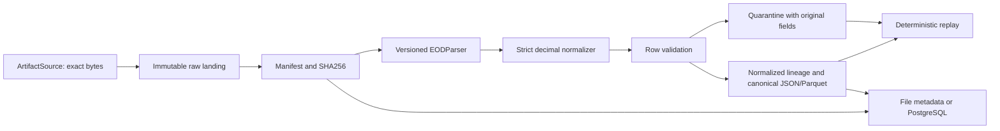

# P2 raw-ingestion development foundation

Authority: user-approved D40-D42, distinct from the original DOCX. P0 COMPLETE;
P1 research/architecture sufficient for development. P1_PRODUCTION_DATA_CLEARANCE
= OPEN; PRODUCTION_MARKET_DATA_USE = NOT_CLEARED. P2 development proceeds independently.
No purchases, subscriptions or required paid services. Stop before P3.



## Boundaries and storage

`alphalens_data.ingestion` is independent of FastAPI and vendor acquisition. The
existing MarketDataProvider boundary is retained. ArtifactSource is a separate
acquisition protocol returning exact bytes; EODParser turns bytes into original
field tuples plus named strings. LocalFileSource and FixtureCSVParser are concrete
offline development adapters. Other providers/formats implement these protocols;
no neutral logic imports NSE, Yahoo or Mendeley adapters.

Default CLI root is ignored `data/p2/`:

```text
raw/<source>/<dataset>/<YYYY>/<MM>/<DD>/<artifact_id>/payload
manifests/<artifact_id>.json
metadata/artifacts/<artifact_id>.json       # file repository
metadata/runs/<run_id>.json                 # file repository
canonical/<run_id>/normalized.json
canonical/<run_id>/canonical.json
canonical/<run_id>/canonical.parquet
canonical/<run_id>/quarantine.json
canonical/<run_id>/report.json
```

The date partition uses the supplied source/session date. For a multiday/unknown
source date, that field stays NULL and acquisition UTC date is the partition date;
it never populates row session or historical availability. The original filename
stays in the manifest; a fixed payload basename avoids untrusted filename paths.
Root-anchored `/data/`, `.local-data/` and verification-local/ are ignored. Only
small constructed TEST_ONLY examples are committed.

## Manifest, identity and immutable publication

Every RawManifest contains artifact_id, nominal_id, source/dataset and non-secret
source_identifier, acquired_at in UTC, source_session_date (nullable),
original_filename, raw_path, byte_size, SHA256, content_type, parser,
normalization/schema versions, classification, currency/rights evidence and
prior_revision_ids. Spec and versions are nested explicitly in the JSON. The
source identifier may be a dataset DOI/reference; request URLs are rejected to
avoid retaining embedded credentials. No source identifier or raw content is logged.

Nominal identity hashes source, dataset, declared source date and original filename.
Artifact identity hashes nominal identity plus exact raw SHA256. Deduplication is
scoped to that nominal artifact, rather than merging unrelated source documents
that happen to contain identical bytes. Identical recapture reuses the original
manifest/acquisition timestamp. Conflicting classification/evidence/version metadata
fails explicitly. Changed bytes produce a new artifact and retain all previously
captured revisions of the nominal document. Lineage orders capture observations;
it does not invent source publication or economic revision times.

Publication writes/fsyncs a temporary file and exclusively links complete bytes
into their final name. A pre-existing target must match exactly; differing bytes
fail instead of overwriting. Raw files receive a read-only OS attribute/mode.
Every read/replay checks original byte size and SHA256. A privileged filesystem
owner can still alter files; altered bytes fail verification, so read-only is not
represented as hardware WORM protection.

Capture uses an exclusive root lock. Concurrent capture fails explicitly rather
than racing revision lineage; the caller may retry. After a process crash, inspect
and remove a stale `.capture.lock` only after ensuring no capture process remains.
Interrupted final publication is safe to retry with identical bytes. Filesystem
and PostgreSQL commits are not a distributed transaction: publication happens
before run metadata; repeating a failed operation repairs missing metadata without
changing existing bytes. Use one shared landing root for revision history; recovered
replicas reuse repository manifests. Parallel writers across independent roots
require future coordination and are not a claimed deployment capability.

## Normalization, validation and quarantine

The fixture CSV requires session_date/open/high/low/close/volume and symbol or
security_id. Optional ISIN, series and source_row_identifier are retained, as are
source filename, parsed row ordinal and raw row checksum. Symbols are source-scoped
identifiers when the source supplies no stable security_id. This is not historical
identifier continuity or a reconstructed market universe.

Dates must be real ISO YYYY-MM-DD calendar dates; no weekday/holiday calendar is
invented. OHLC values must be finite positive decimals. Malformed numeric strings,
missing values, fractional/negative/overflow volume, invalid headers/UTF-8/CSV and
row-width mismatches are explicit errors. Exact Parquet decimal128(38,18) limits are
checked before output; values are never rounded to fit. Volume is non-negative
int64. Currency is INR only when the spec includes evidence; otherwise NULL.

Rules: high >= open/close/low; low <= open/close; identifiers present; valid session
date; no duplicate (security, session_date, source_version). All ambiguous duplicate
members are quarantined, with no arbitrary winning row. Output is sorted by security,
session and source row ordinal. Valid siblings remain usable within declared fixture
scope: AVAILABLE means valid nonempty fixture output, DEGRADED means valid output
plus quarantine, UNAVAILABLE means no valid output. These statuses do not certify
live freshness, exchange-session validity, completeness or production suitability.

Quarantine stores exact parsed original fields, rule, reason, source-row ordinal,
artifact/hash, classification, versions and a stable first-capture timestamp.
Multiple failed rules can describe one quarantined row; report counts distinguish
rows from errors. Artifact-level parse failures retain the raw bytes even when a
field tuple cannot be decoded. No invalid row is silently deleted or imputed.

## Provenance and replay

canonical.record_id -> normalized_record_id in normalized.json -> versions/parser
and source-row ordinal/hash -> artifact_id/manifest -> raw SHA256/path -> source.
normalized.json holds typed normalized fields without the final canonical ID.
Canonical JSON preserves exact decimal strings; Parquet has typed decimals, dates,
volume, NULL temporal metadata, classification and lineage fields. Tests join
normalized identities and independently recompute row/raw SHA256.

Replay rereads/checksums original bytes and requires exactly the captured parser,
normalizer and schema versions. It compares normalized/canonical JSON, quarantine,
run hashes/counts and Parquet bytes to persisted results. Quarantine timestamps
reuse original capture time, not replay wall time. Parquet byte equality is verified
in the locked environment; cross-version PyArrow binary equality is not promised.
Version changes are rejected in this milestone; future reprocessing must explicitly
register a new processing version without rewriting the original manifest.

## Classification and development commands

TEST_ONLY, RESEARCH_FIXTURE and PRODUCTION are explicit classifications.
Production capture is disabled while clearance is OPEN. Research capture requires
an already accepted rights/attribution reference; assigning the label does not
establish licence clearance. Every output retains classification and
production_claims_permitted=false. This foundation has no performance/claim engine.
Neither fixtures nor source-scoped cohorts prove PIT eligibility, survivorship
control, historical universe coverage or real investment results.

```powershell
uv sync --frozen
uv run --frozen alphalens-ingest tests/fixtures/p2/TEST_ONLY.csv --spec tests/fixtures/p2/TEST_ONLY.spec.json
uv run --frozen python scripts/verify_p2_postgres.py
```

The first command uses file metadata and automatically verifies replay. Repeating
it reports a duplicate without new raw records. CLI roots must stay inside ignored
data/ or .local-data/. `--postgres` selects the PostgreSQL repository using an
ignored/environment ALPHALENS_TEST_DATABASE_URL after db migration application.
There is no SQLite fallback. The verification helper starts free local PostgreSQL
17 on loopback 55432 with generated ephemeral secrets, runs tests/CLI and removes
only its dedicated Compose project/volume. Normal development databases are untouched.

Structured JSON logs record ingestion_started, artifact_acquired,
checksum_generated, duplicate_detected, parsing_complete, validation_failures,
normalization_complete and replay_result. Logs contain safe IDs/counts, not request
URLs, credentials, DSNs, raw rows or entire datasets. CLI failures redact unknown
exception details.

P3's broader quality/freshness policies, licensing-aware retention, verified
exchange calendars and recovery operations remain deferred. No source scheduler,
live acquisition, ML, features, labels, backtests or product UI is implemented.
