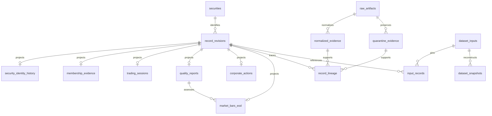

# P5 canonical data model — development contract

D46-D48 authorize P5 from approved P4 `59da9a82d5c0f6f5a39fd36b4f645cc10035261b`
on `p5-canonical-data-model`. The original DOCX is unchanged. This is a development
model tested with constructed TEST_ONLY evidence, not cleared production market
data. Stop before P6. Verification is recorded in [the P5 report](../development/p5-verification-report.md).

## Entities and ownership

`alphalens_data.canonical` integrates existing contracts. It never imports FastAPI.
`Security` holds a durable internal ID, exchange and immutable data classification.
A symbol is never its primary key. Current listing/type flags do not live in this
registry. Temporal identity and eligibility facts remain P4 `IdentityFact` and
`MembershipFact`, wrapped with P5 revision headers without changing their values.
ISIN, source security ID, symbol, series and aliases live in those identity facts.
Optional display name, INR currency and exchange ID require same-revision evidence.
Listing status and security type remain dated membership evidence, resolved by P4.

Canonical session evidence stores an exchange-local date, NSE/CASH/EOD scope,
calendar status, optional evidenced close and provenance. Supported statuses are
VERIFIED_TRADING_SESSION, VERIFIED_NON_TRADING_SESSION and UNKNOWN_SESSION_STATUS.
The actual historical NSE calendar remains unresolved. A fixture's explicitly
authored close is not an exchange-calendar claim. Session receipt/publication/
availability are separately dated; session_date is never treated as an instant.

An EOD observation binds a durable security, session, revision, source lineage,
currency, basis and P3 quality reference. Positive finite Decimal OHLC and strict
nonnegative int64 volume reuse P2's financial policy. Optional exact turnover,
trade count and VWAP stay null when unknown. P2-normalized values are compared
exactly against the source observation. A quarantined row is retained with
`values=null`, rejection reasons and quarantine lineage; invalid prices are not
repaired to satisfy database constraints.

Price basis is OBSERVED_UNKNOWN_BASIS, RAW_UNADJUSTED or ADJUSTED. P2's unknown
adjustment state is preserved. Known basis requires evidence. Adjusted observations
require separately supplied values, method/version/factor, effective date, action
key, original verified RAW_UNADJUSTED observation key and adjustment provenance.
The action must have been available by the adjusted observation's availability.
There is no adjustment engine, overwriting of observed prices, or seeded adjustment.

Corporate actions support SPLIT, BONUS, DIVIDEND, RIGHTS, MERGER, DEMERGER,
SYMBOL_CHANGE, DELISTING and OTHER. Canonical headers retain publication,
availability, ingestion and revision; event fields retain effective/ex, record and
payment dates, nullable exact factor/cash value and currency. Fields irrelevant or
unsupported by evidence stay null. The fixture contains one authored symbol-change
event, not invented actions for real securities. Action reads return known announced
events; effective dates remain visible even if an announced event is still future.

`FundamentalRevision` defines named statement facts, statement type, reporting basis,
period start/end, units/currency, nullable signed Decimal value and restatement,
with the same independent knowledge/revision header. Period end is not availability.
`FUNDAMENTAL_PIT_DATA = UNAVAILABLE`: repositories reject fundamental writes;
reads return UNAVAILABLE with an explicit reason and no values. No fundamental
table or populated facts are required before a legally usable free PIT source exists.

## Time, revisions and point-in-time reads

Identity/membership effective intervals use P4's `[effective_from, effective_to)`;
null end is open. Point observations retain their event/session dates, not a
synthetic intraday effective instant. Invalid/inverted intervals are rejected.
Exclusive identity/membership intervals and simultaneous identifiers are checked
by the existing P4 resolver, rather than a competing implementation.

`published_at` is source publication; `available_at` is evidenced historical
knowability; `ingested_at` is declared actual receipt. Raw manifests independently
retain P2 capture receipt, including capture of authored fixture declarations.
They are not collapsed. Known availability requires VERIFIED_PUBLICATION or an
evidenced CONSERVATIVE_BOUND; unknown availability remains null and is never
selected by a PIT read. Completed known EOD observations require an evidenced close
no later than availability/receipt. All actual timestamps require an offset and
normalize to UTC. Session date stays local to Asia/Kolkata for this NSE context.

Revision identity includes kind, source, logical record ID, revision ID and
classification. Roots are number 1; successors explicitly identify the parent and
increment by one. Chains cannot branch, change security/source/classification/scope,
or invert knowledge/receipt order. Identical replays are idempotent; conflicting
same-key content is rejected. Corrections append evidence rather than overwrite it.
Unknown-availability successors cannot replace previously known facts.

`ReadContext.knowledge_cutoff` selects the highest known revision per logical record
with available_at <= cutoff. Historical mode may reconstruct an evidenced historical
publication captured later. Live mode additionally requires ingested_at <= cutoff.
These modes deliberately answer different questions. Effective identity selection
then uses session date through P4; future listing/type/symbol effects are not applied
backward. Future delisting knowledge cannot remove earlier membership.

`CanonicalReader` offers `prices_as_of`, `security_metadata_as_of`, `sessions_as_of`,
`corporate_actions_as_of`, `fundamentals_as_of` and `universe_as_of`. Reads expose
explicit availability/reasons, including an empty UNAVAILABLE price family before
knowledge exists. `load_reader(DatasetRepository, input_id)` hides P2 paths from
downstream callers. Separate security, revision and dataset repository protocols
have memory implementations and PostgreSQL implementations; memory is a test/file
tool, never a SQLite replacement. Indexed P4 histories are reused per read context.
No unmeasured throughput claim is made.

## Quality and universe integration

P3 report bytes/SHA256, validator version and session assessments are preserved in
`QualityRevision`. Reports must retain P3's severity/gate invariants. The price's
quality reference is source/session scoped. P4 resolves the latest known quality
revision per session, along with its original identity/membership facts.
Membership and analytical eligibility remain separate. A rejected G observation
has historical membership, unusable price values and explicit rejection reasons.
ETF/unknown classes remain excluded without deleting their historical evidence.
CURRENT_SNAPSHOT_ONLY continues to fail loudly through P4.

Availability (AVAILABLE/DEGRADED/STALE/UNAVAILABLE) is distinct from P3 quality
(VALID/DEGRADED/REJECTED). A rejected evidence record may exist in storage while
its numerical values are unavailable. STALE requires a caller-supplied freshness
bound plus policy reference; no arbitrary live freshness/calendar assumption exists.
Analytical eligibility requires known usable values, acceptable bound P3 quality,
P4's contemporaneous analytical eligibility, membership, and a satisfied freshness
policy. No observations are silently filtered from immutable historical storage.

## Lineage and deterministic snapshots

Every revision has a normalized authored declaration and source evidence lineage:
canonical revision → normalized P2/reference record or P2 quarantine → P2 raw
artifact → SHA256/source/classification/acquisition metadata. P2 canonical record
IDs, normalized IDs, row checksums and parser/normalizer/schema versions survive.
Reference documents use P2 `RawLanding`, including original P4 evidence and P3
report bytes, not a second artifact store. Local verification checks raw bytes,
replays P2 parsing/normalization and verifies reference normalization. The current
developer assembler supports the documented FixtureCSV and reference adapters;
unsupported parser versions fail explicitly.

`CanonicalBatch.input_id` hashes stable sorted complete inputs: securities, P4
definition, manifests/runs, normalized/quarantine records, revision payloads and
lineage. Local filesystem root hints are external to the identity. A dataset ID
hashes the canonical snapshot excluding only its own ID, including schema
`p5.canonical.v1`, input ID, normalization and validation versions, P4 definition,
knowledge mode/cutoff, session range, selected observations and P4 snapshots.
Changed revisions, source evidence or versions produce a different identity.

Snapshots pin their input ID. Rebuilding identical inputs/versions/context yields
identical JSON, ID and Parquet bytes. New corrections require an explicitly new
input set/snapshot; saving a changed payload at an existing ID fails. Full input
hashes may identify evidence not yet known, but usable snapshot facts never have
availability after cutoff. Queries use availability/effective semantics, not the
hash as knowledge. Fresh captures have new receipt evidence; repeatability is over
the same immutable capture, not independently recaptured bytes/receipt times.

TEST_ONLY and RESEARCH_FIXTURE classification propagate through artifacts, revisions,
registry and snapshots. Mixed classifications are rejected. Research provenance
still requires rights evidence. PRODUCTION writes are disabled, including in SQL;
fixture classification cannot silently upgrade. Production investment claims are false.

## PostgreSQL and Parquet

`db/migrations/002_p5_canonical.sql` owns canonical securities, shared immutable
record revisions, identity history, membership evidence, trading sessions, quality
reports, corporate actions, EOD bars, normalized/quarantine evidence, record lineage,
pinned dataset inputs/input-record links and snapshots. Existing P2 raw artifacts
and runs are reused via foreign keys. The common revision header avoids repeating
knowledge semantics across unrelated entity tables. JSON retains the complete
versioned contract, including sparse event fields, aliases and exact P3/P4 content;
typed domain projections provide transactional constraints and query indexes.
Projection triggers enforce agreement with canonical payloads. Deferred lineage
checks require matching source/classification/checksum and normalized declaration.



Constraints cover PK/FK/unique revision identity, one successor, parent consistency,
time order, half-open intervals, allowed states/classes, nonnegative volume and
finite positive OHLC/range invariants. Mutation triggers protect all canonical
tables. Unknown/rejected values use a complete null bar plus reasons. Core indexes:
kind/security/available/revision for PIT lookup; security/effective intervals;
symbol and non-null ISIN for identity lookup; security/session and session for bars;
lineage by record; input/cutoff/range for snapshots. Existing unique indexes cover
source/logical revision identity. No speculative model/feature indexes exist.

PostgreSQL is transactional canonical storage. Parquet is one dataset-ID-addressed
analytical projection, with stable field order/dtypes/sorting, schema version,
input/dataset IDs and cutoff metadata. It preserves exact OHLC, optional values,
timestamps, revision/basis/source/hash/classification, quality and eligibility links.
Full sparse evidence and reasons stay in sibling immutable JSON and canonical
lineage. There are no independently edited analytical copies.

Persisted financial values use Decimal and NUMERIC(38,18)/decimal128(38,18), with
at most 20 integral and 18 fractional digits. Finite exact decimal text/Decimal is
accepted; floats, overflow, excess precision and rounding are rejected by Python.
Projection agreement detects SQL price/action rounding against the declared exact
payload. Volume/trade count use strict nonnegative int64. No currency/ratio/price
unit is inferred. A future numerical consumer may perform controlled float
conversion downstream; no such consumer is implemented in P5.

## Developer commands and limits

```powershell
uv run --frozen python -m scripts.build_p5_test_fixture --data-root data/p5-test-only
uv run --frozen alphalens-canonical-build data/p5-test-only/canonical-input.json --knowledge-cutoff 2024-01-20T12:00:00Z --start 2024-01-01 --end 2024-01-20 --output data/p5-snapshots
uv run --frozen python scripts/verify_p5_postgres.py
```

For a configured local database, apply db/ migrations and pass `--postgres` with
ALPHALENS_DATABASE_URL supplied securely via environment. CLI emits dataset/schema/
cutoff/classification/counts/family states, never recommendations or connection
details. Output must use ignored `data/` or `.local-data/`. The disposable verification
runner uses PostgreSQL 17, a dedicated loopback Compose project, generated temporary
credentials, isolated P5 test database, and finally removes its containers/network/
volume. It also repeats the PostgreSQL canonical CLI build for idempotency.

The fixture reuses P4 A-H histories, P2 normalization/quarantine and P3 reports:
survivor, new listing, departure, timely/late symbol change, ETF, unknown type,
invalid session and unavailable observation; it adds a Jan 10 price correction known
Jan 15, explicit fixture knowledge/close declarations and symbol-change evidence.
Fundamentals remain unavailable. Fixture correctness proves software mechanics,
not actual NSE coverage, legal production rights, unbiased performance or complete
corporate-action/calendar history. Real PIT fundamentals, exchange calendar,
historical NSE/index membership and production data clearance remain unresolved.
No P6 features, labels, ML, evaluation, backtesting or decision/UI logic exists.
